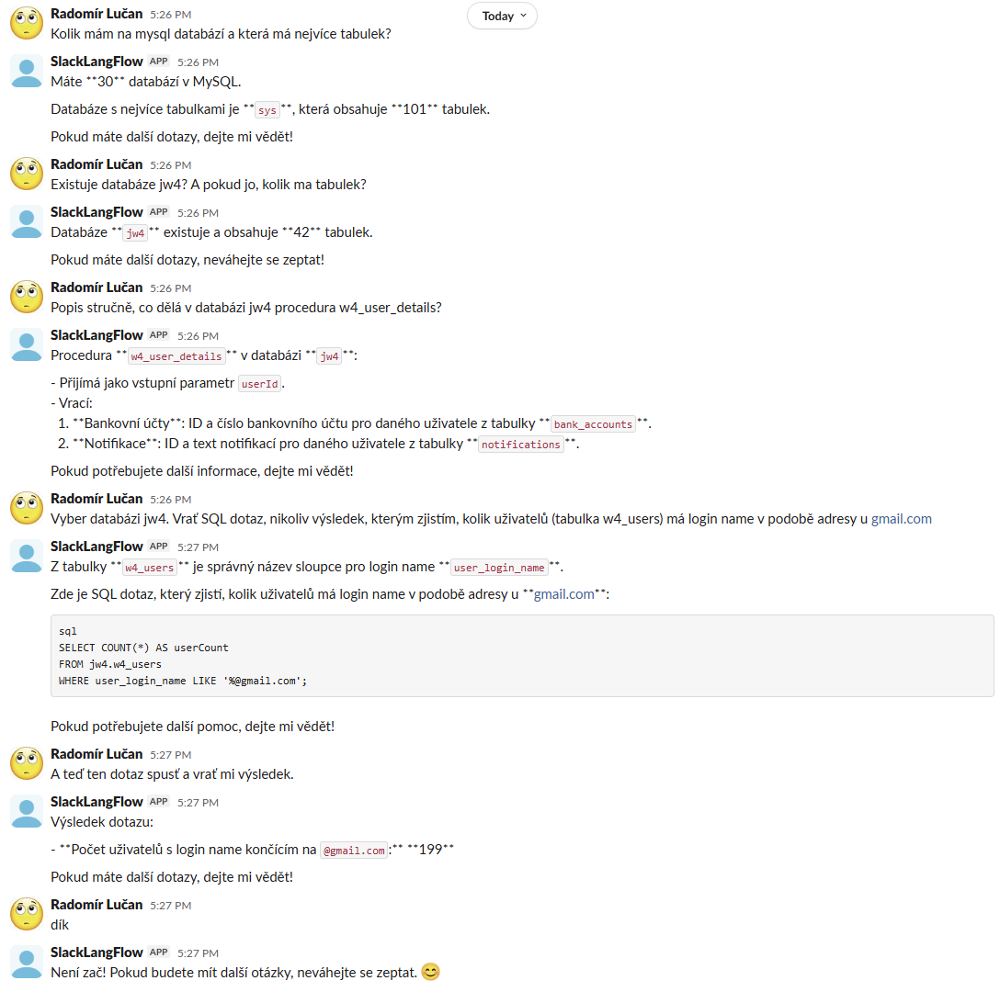

# Slack MySQL Assistant

Tento projekt implementuje AI asistenta pro Slack, který umí komunikovat s MySQL databází pomocí Langflow workflow a MCP (Model Context Protocol) serveru.

## Architektura

Projekt se skládá ze tří hlavních komponent:

### 1. **Slack Auth Hack** (`slack-auth-hack/app.py`)
Flask aplikace sloužící jako webhook endpoint pro Slack události:
- **URL verification**: Zpracovává Slack challenge při registraci webhooku
- **Event forwarding**: Přeposílá zprávy ze Slacku do Langflow webhooku
- **Bot message filtering**: Ignoruje zprávy od botů, aby se zabránilo zacyklení
- **Payload transformation**: Extrahuje `text`, `channel` a `user` ze Slack eventu a posílá je do Langflow
- **Konfigurace přes `.env`**: Aplikace načítá `../.env` pomocí `python-dotenv` – `LANGFLOW_WEBHOOK` URL tak stačí nastavit v `.env` souboru v kořeni projektu

Poznámka: Asi by vše šlo pořešit v kódu Webhook nodu, ale jako příjemný bonus vyšlo i to, že takto je to verifikační URL, které je
třeba zadat na api.slack.com, stále stejné (https://<ngrok-url>.ngrok-free.dev/slack) a nteřeba jej měnit s
každým restartem langflow. Stačí jej lokálne změnit v .env

### 2. **Langflow Workflow** (`Slack MySQL Assistant.json`)
Vizuální workflow pro zpracování Slack zpráv a komunikaci s databází:

#### Komponenty workflow:
1. **Webhook** (`Webhook-c36FZ`)
   - Přijímá HTTP POST požadavky z Flask aplikace
   - Parsuje JSON payload ze Slacku

2. **SlackPayloadParser** (`SlackPayloadParser-TYcoL`)
   - Extrahuje zprávu z Slack payloadu
   - Převádí data do formátu Message pro agenta

3. **Agent** (`Agent-r37k3`)
   - AI agent s přístupem k nástrojům (tools)
   - Používá OpenAI model
   - Zpracovává uživatelské dotazy a rozhoduje, kdy použít databázové nástroje
   - Má systémový prompt pro asistentské chování

4. **MCPTools** (`MCPTools-A1Orz`)
   - Poskytuje agentovi nástroje pro práci s MySQL databází
   - Připojuje se k MCP serveru pro MySQL operace
   - ⚠️ **Přihlašovací údaje k MySQL jsou natvrdo v konfiguraci tohoto nodu** (user, password, host, port). Nepodařilo se přimět Langflow, aby si je natáhl z env proměnných – MCPTools node předává connection string přímo MCP serveru a Langflow v tomto místě workflow substituci env proměnných nepodporuje.

5. **SlackOutput** (`SlackOutput-Y1trP`)
   - Posílá odpověď agenta zpět do Slack kanálu
   - Používá Slack Bot Token pro autentizaci
   - Publikuje zprávy přes Slack API (`chat.postMessage`)

6. **ChatOutput** (`ChatOutput-EJ8D9`)
   - Zobrazuje výstup v Langflow UI pro debugging

#### Tok dat:
```
Slack → Flask App → Webhook → SlackPayloadParser → Agent (+ MCPTools) → SlackOutput → Slack
```

### 3. **Docker Compose** (`docker-compose.yaml`)
Orchestrace služeb:

- **langflow**: Langflow server na portu 7860
  - Poskytuje vizuální editor a runtime pro AI workflow
  
- **mcp-mysql**: MCP server pro MySQL
  - Node.js kontejner s `mcp-server-mysql` balíčkem
  - Připojuje se k MySQL databázi na `host.docker.internal:3306`
  - Poskytuje nástroje pro SQL dotazy přes MCP protokol

- **Síť**: `langflow-net` pro komunikaci mezi kontejnery

## Jak to funguje

1. Uživatel napíše zprávu ve Slack kanálu
2. Slack pošle event na Flask webhook (`/slack` endpoint)
3. Flask aplikace přepošle zprávu do Langflow webhooku
4. Langflow workflow:
   - Parsuje Slack payload
   - Předá zprávu AI agentovi
   - Agent analyzuje dotaz a případně použije MCP nástroje pro dotaz do MySQL
   - Agent vygeneruje odpověď
   - Odpověď se pošle zpět do Slacku
5. Uživatel vidí odpověď od bota ve Slacku

## Požadavky

- Docker a Docker Compose
- Slack workspace s nakonfigurovaným botem a Event Subscriptions
- MySQL databáze dostupná na `localhost:3306`
- OpenAI API klíč pro AI agenta
- Python balíček `python-dotenv` pro Flask aplikaci (`pip install python-dotenv`)

## Konfigurace

### Slack Bot
- Bot Token: Nakonfigurován v `SlackOutput` komponentě
- Channel ID: Cílový Slack kanál pro odpovědi
- Event Subscriptions: Webhook URL směřující na Flask aplikaci

### MySQL
- Host: `host.docker.internal` (pro přístup z Docker kontejneru)
- Port: `3306`
- User, Password: nakonfigurovány **přímo v MCPTools nodu v Langflow** (viz poznámka výše – env proměnné zde nefungují)

### Langflow
- Webhook URL: nastavena v `.env` jako `LANGFLOW_WEBHOOK` (Flask aplikace si ji odtud načte)

## Spuštění

```bash
# Spustit Langflow a MCP server
docker-compose up -d

# Spustit Flask aplikaci (v samostatném terminálu)
cd slack-auth-hack
pip install python-dotenv flask requests   # pokud ještě není nainstalováno
python app.py
```

## Poznámky

- Flask aplikace běží na portu `5000`
- Langflow UI je dostupné na `http://localhost:7860`
- Workflow je třeba naimportovat do Langflow z `Slack MySQL Assistant.json`
- Pro produkční použití je nutné zabezpečit API klíče a tokeny pomocí environment variables. `SLACK_BOT_TOKEN` a `OPEN_AI_API_KEY` jsou předávány Langflow přes Docker Compose z `.env` souboru. `LANGFLOW_WEBHOOK` si načítá Flask aplikace. MySQL přihlašovací údaje jsou výjimkou – jsou natvrdo v MCPTools nodu, protože Langflow je v tomto místě neumí číst z env.

Na závěr ukázka konveraze: 



